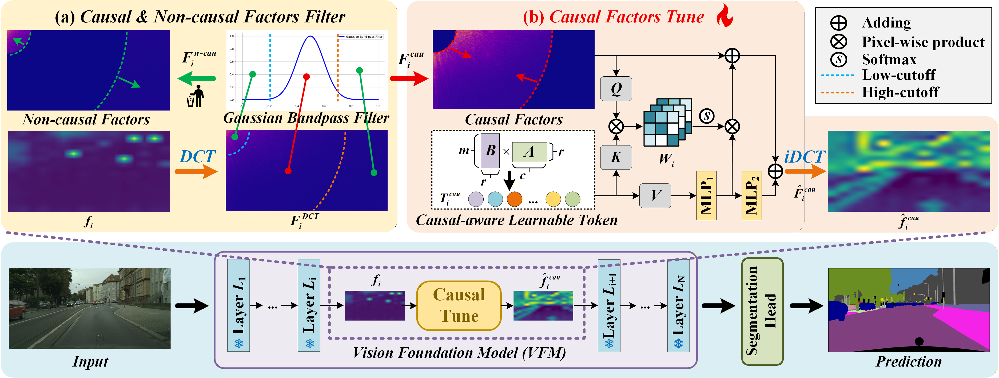

#  Causal-Tune
## [AAAI 2026] Causal-Tune: Mining Causal Factors from Vision Foundation Models for Domain Generalized Semantic Segmentation

## :bell: Updates
+ 2025-12-19: Paper is available. [arXiv](https://arxiv.org/pdf/2512.16567)
+ 2025-12-16: Code is available now.




## 1. Environment Setup
To set up your environment, execute the following commands:

```bash
conda create -n Causal-Tune -y
conda activate Causal-Tune
conda install pytorch==2.0.1 torchvision==0.15.2 torchaudio==2.0.2 pytorch-cuda=11.8 -c pytorch -c nvidia
pip install -U openmim
mim install mmengine
mim install "mmcv==2.1.0"
min install mmpretraion
pip install "mmsegmentation>=1.0.0"
pip install "mmdet==3.3.0"
pip install xformers=='0.0.20' # optional for DINOv2
pip install -r requirements.txt
pip install future tensorboard
```

## 2. Dataset Preparation

+ **Cityscapes:** Download `leftImg8bit_trainvaltest.zip` and `gt_trainvaltest.zip`, extract them to `data/cityscapes`.

+ **Mapillary:** Download MAPILLARY v1.2, extract it to `data/mapillary`.

+ **GTA:** Download all image and label packages, extract them to `data/gta`.

+ **ACDC**: Download all image and label packages, extract them to `data/acdc`.

Prepare datasets with these commands:

```shell
cd Causal-Tune
mkdir data
# Convert data for validation if preparing for the first time
python tools/convert_datasets/gta.py data/gta # Source domain
python tools/convert_datasets/cityscapes.py data/cityscapes
# Convert Mapillary to Cityscapes format and resize for validation
python tools/convert_datasets/mapillary2cityscape.py data/mapillary data/mapillary/cityscapes_trainIdLabel --train_id
python tools/convert_datasets/mapillary_resize.py data/mapillary/validation/images data/mapillary/cityscapes_trainIdLabel/val/label data/mapillary/half/val_img data/mapillary/half/val_label
```

## 3. Pretraining Weights

+ **Download:** Download pre-trained weights from **facebookresearch (dinov2_vitl14_pretrain.pth)** for testing. Place them in the project directory without changing the file name.
+ **Convert:** Convert pre-trained weights for training or evaluation.
  ```bash
  python tools/convert_models/convert_dinov2.py checkpoints/dinov2_vitl14_pretrain.pth checkpoints/dinov2_converted.pth
  ```

```
(optional for 1024x1024 resolution)

```bash
python tools/convert_models/convert_dinov2.py checkpoints/dinov2_vitl14_pretrain.pth checkpoints/dinov2_converted_1024x1024.pth --height 1024 --width 1024
```

The final folder structure should look like this:

```
Causal-Tune
├── ...
├── checkpoints
│   ├── dinov2_vitl14_pretrain.pth
│   ├── dinov2_rein_and_head.pth
├── data
│   ├── cityscapes
│   │   ├── leftImg8bit
│   │   │   ├── train
│   │   │   ├── val
│   │   ├── gtFine
│   │   │   ├── train
│   │   │   ├── val
│   ├── bdd100k
│   │   ├── images
│   │   |   ├── 10k
│   │   │   |    ├── train
│   │   │   |    ├── val
│   │   ├── labels
│   │   |   ├── sem_seg
│   │   |   |    ├── masks
│   │   │   |    |    ├── train
│   │   │   |    |    ├── val
│   ├── mapillary
│   │   ├── training
│   │   ├── cityscapes_trainIdLabel
│   │   ├── half
│   │   │   ├── val_img
│   │   │   ├── val_label
│   ├── gta
│   │   ├── images
│   │   ├── labels
├── ...
```

### :rotating_light: Please refer to [Rein](https://github.com/w1oves/Rein) (CVPR2024) for more details.

## 4. Training

Run the training (C2ACDC as example):

```
python tools/train.py cconfigs/dinov2_C2ACDC/rein_dinov2_mask2former_512x512_bs1x4.py --work-dir exps/C2ACDC
```

## 5. Evaluation

Run the evaluation (C2ACDC5_512x512 as example):

```
python tools/test.py configs/dinov2_C2ACDC/rein_dinov2_mask2former_512x512_bs1x4.py exps/C2ACDC/iter_40000.pth --backbone checkpoints/dinov2_converted.pth
```
## 6. Acknowledgements
+ The code is based on [Rein](https://github.com/w1oves/Rein) (CVPR2024) and [SET](https://dl.acm.org/doi/pdf/10.1145/3664647.3680906) (ACM MM2024).
+ In addition, some codes are borrowed from [MAD](https://github.com/K2OKOH/MAD) (CVPR2023).

**Many thanks for these great works!**
